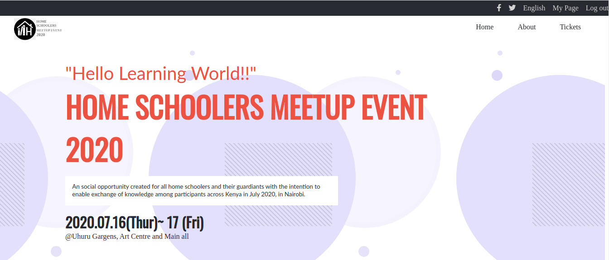
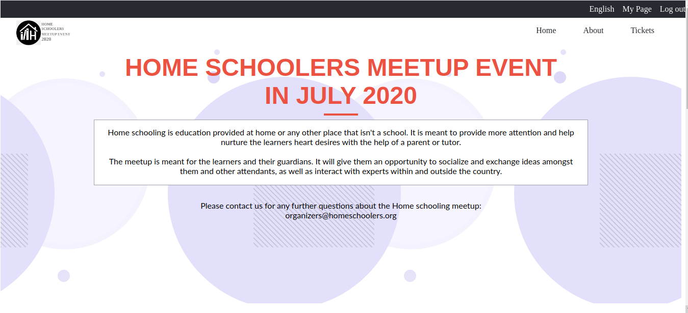
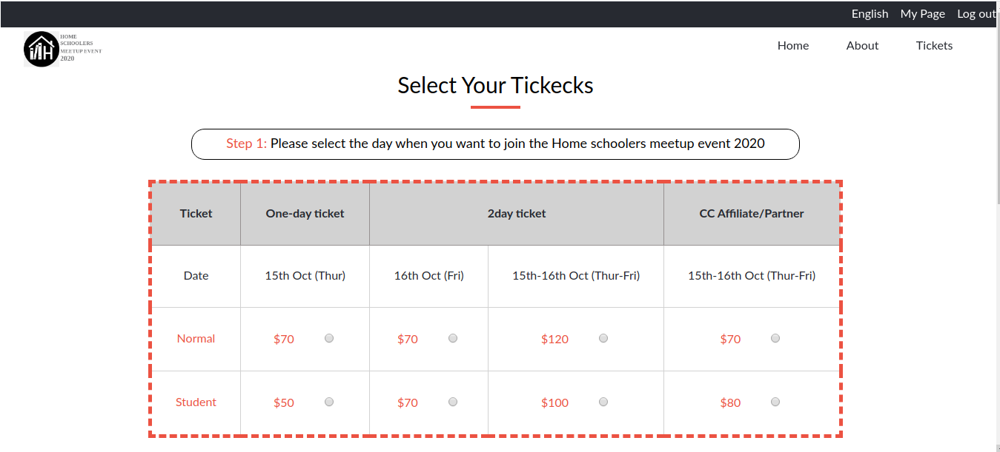

# HTML-CSS-Capstone-Project
This is a repository for the final project in the first section of the main technical curriculum  section in Microverse Program.
It is a homeschoolers meetup site that contains 3 pages all linked to each other
> 

> 

> 

> 

## Built With

- HTML &,
- CSS,
- Linters

## Live Demo

[Live Demo Link](https://rawcdn.githack.com/Phylis05/HTML-CSS-Capstone-Project/f44f65ffee1bdc6ae07347482a9a52484a9be30a/index.html)

## Getting Started

To get a local copy up and running follow these simple example steps.

### Prerequisites

A browser of your choice preferrably Chrome.

### Setup

Fork this project to your local machine
Open the index.html file in any browser or edit using Visual Code or the preference IDE for web development

## Author

👤 **Phylis Chepchumba**

- Github: [@phlylis05](https://github.com/phlylis05)
- Linkedin: [PhylisChepchumba](https://linkedin.com/PhylisChepchumba)

## 🤝 Contributing

Contributions, issues and feature requests are all welcome!

Feel free to check the [issues](https://github.com/Phylis05/HTML-CSS-Capstone-Project/issues) page.

## Show your support

Give a ⭐️ if you like this project!!

## Acknowledgments

- W3Schools
- The Odin Project 
- [Cindy Shin](https://www.behance.net/adagio07) in Behance

## 📝 License

- The original design is licenced under the [Creative Commons 4.0 license](https://creativecommons.org/licenses/by-nc/4.0/).

